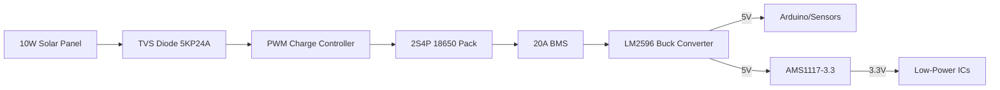
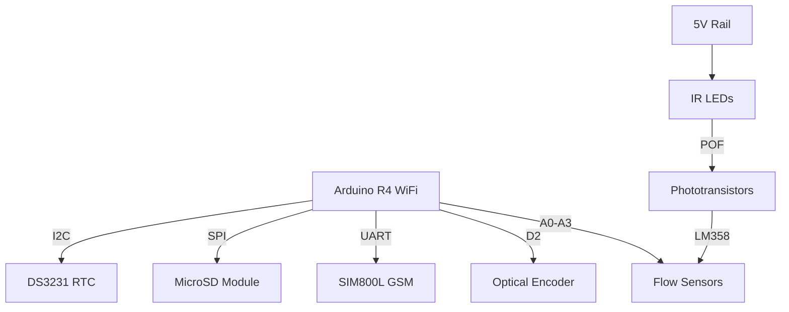
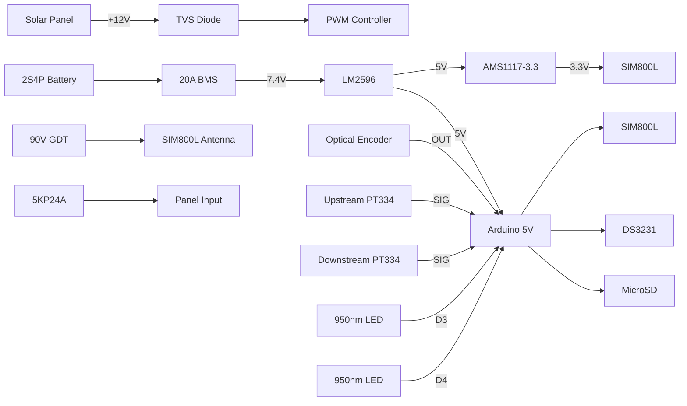
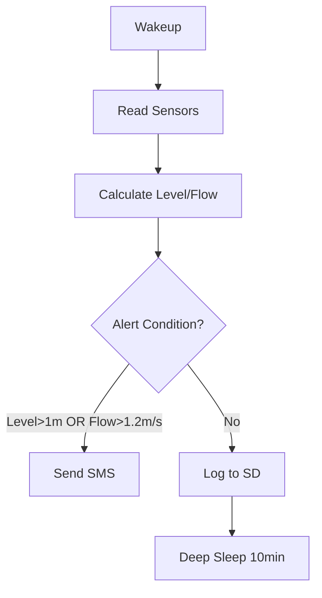
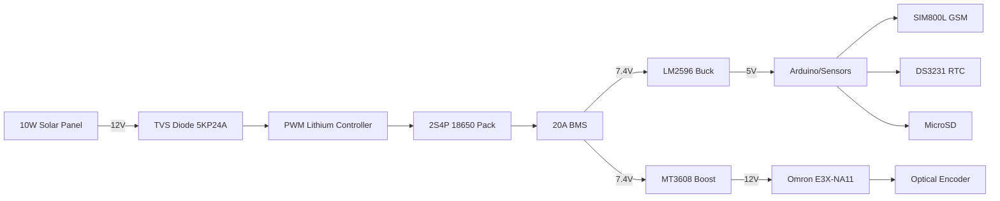
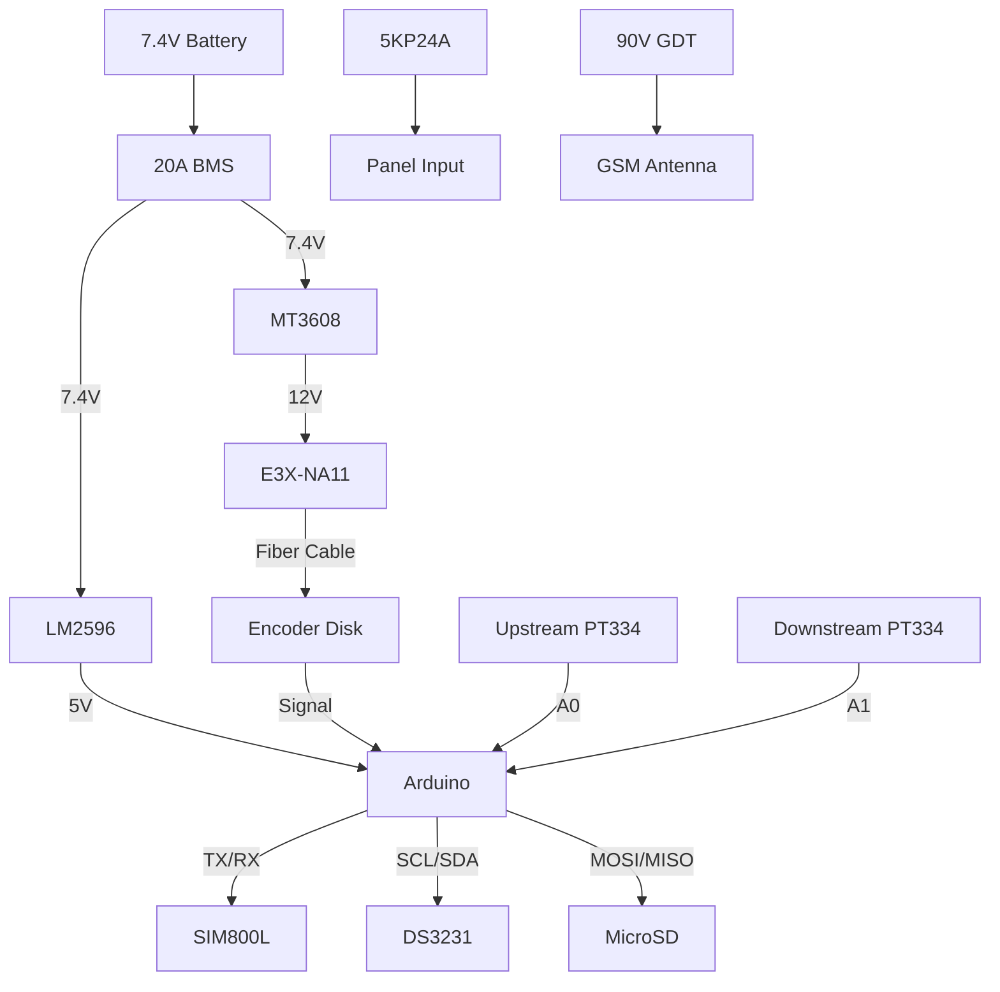

# Agos Hardware Schematic

Created: July 30, 2025 12:17 AM

<aside>
💡

</aside>

### 📌📌📌

We are designing a device that combines:

1. Water Level Monitoring: Pulley-float system with optical encoder (Omron E3X-NA11 + E32-LT11)
2. Water Flow Monitoring: POF (Plastic Optical Fiber) based turbidity correlation sensing with two sensors (upstream and downstream)
The system uses:
- Arduino R4 WiFi as the main controller
- SIM800L for SMS alerts
- MicroSD for data logging
- Solar power with 2S4P 18650 battery (7.4V, 12Ah) and a 10W solar panel
We need a full schematic including:
- Power supply circuit (solar charging, battery management, voltage regulation)
- Water level sensor interface (optical encoder)
- Water flow sensor interface (two IR LEDs and two phototransistors for POF)
- SIM800L module interface
- MicroSD card interface
- Real-Time Clock (DS3231) for timekeeping
Let's break down the schematic into sections.
1. Power Supply Section:
    - Solar panel connected to a PWM lithium charge controller (for 2S battery)
    - 2S4P battery pack (7.4V nominal) connected to the charge controller
    - Battery output goes to a 20A BMS for protection
    - BMS output goes to:
    a. LM2596 buck converter to step down to 5V for the main system
    b. Direct connection to the SIM800L (which can handle up to 4.4V, so we need a voltage regulator for it? Actually, SIM800L requires 3.4V to 4.4V. We cannot connect 7.4V directly. So we need to step down to 4V for SIM800L? But note: the LM2596 we are using for 5V. We can use a separate regulator for SIM800L? However, SIM800L can draw up to 2A peaks. We can use a 3.3V or 4V regulator? Actually, the SIM800L module usually has a built-in regulator. The common SIM800L module has a voltage regulator that accepts 3.7V to 4.2V (so we can power it from the battery? But our battery is 2S: 7.4V). So we cannot connect directly.
    Let me re-think:
    Option 1: Use a separate buck converter for the SIM800L to step down to 4V. But note that the SIM800L module has a MIC29302 regulator that requires input above 3.5V and below 5V. So we can power it from the 5V rail? But the SIM800L module has a voltage regulator that expects 3.7V to 4.2V? Actually, the module typically has a 1117-3.3V or similar. However, the module is designed for a single-cell Li-ion. So we must step down the 7.4V to 4V? Alternatively, we can use a 3.3V regulator for the SIM800L? But note: the SIM800L chip itself requires 3.4V to 4.4V. The module usually has a regulator that takes 5V and outputs 3.8V? Actually, the common SIM800L module has a 4V LDO (AMS1117-4.0) or similar. But I see many designs powering the SIM800L module with 5V.
    After checking: The SIM800L module has a built-in 3.3V regulator? Or is it designed for 3.7V? Actually, the module typically has a 4V regulator. But the module's input voltage is 5V? The module has a 1117-4.2 or 4.0? Actually, the module is designed for 5V input? Or 3.7V?
    Clarification: The SIM800L module (the blue board) typically has a 4V regulator and can be powered by 5V. The input pin VCC is 5V. So we can connect it to the 5V rail.
    Therefore, we can power the SIM800L module from the 5V rail.
    So the power plan:
    Solar Panel -> PWM Charge Controller (for 2S) -> 2S Battery -> 20A BMS -> LM2596 buck converter (to 5V) -> 5V rail
    The 5V rail powers:
        - Arduino R4 (5V tolerant, and it has its own 3.3V regulator for the ESP32 part)
        - SIM800L module (5V input)
        - Optical encoder (Omron E3X-NA11: 10-30V DC? But we can use 5V? Check datasheet: The E3X-NA11 can work at 12-24V, so we need 12V? Actually, the E3X-NA11 has a model that works at 5V? The E3X-NA11-V is 5-24V. So we can use 5V. But note: the optical fiber sensor amplifier might require more current? Let me check: typical current 50mA. So we can power it from 5V.
        But what about the IR LEDs for the flow sensor? They are powered from 5V? Yes, through a resistor.
        So we have a 5V rail for everything.
        However, the phototransistors for the flow sensor? They are connected to the analog inputs of the Arduino. They will be powered from the 5V rail? Yes.
        So we need:
        - One LM2596 buck converter to convert 7.4V (battery) to 5V.
        We also need to monitor the battery voltage? We can use a voltage divider (with high resistance to not drain the battery) connected to an analog input.
2. Water Level Sensor (Optical Encoder):
    - The Omron E3X-NA11 is the amplifier, and the E32-LT11 is the fiber unit. We have one set.
    - The amplifier has a digital output? The E3X-NA11 has an NPN open collector output. We can connect it to the Arduino interrupt pin for counting pulses.
    Wiring:
        - Vcc (5V) to amplifier
        - GND to amplifier
        - Output of amplifier to Arduino digital pin (with a pull-up resistor if needed)
        The encoder disk is attached to the pulley and interrupts the light in the fiber.
3. Water Flow Sensor (POF based):
    - We have two sensing points: upstream and downstream.
    - Each sensing point has:
        - An IR LED (950nm) that sends light into the POF cable (one end of the stripped section)
        - A phototransistor (PT334-6C) that receives light from the other end of the stripped section.
        However, note: the light is partially scattered by the water in the flow cell. So the phototransistor output will vary with turbidity and flow.
        We need to drive the IR LEDs. We will use two separate channels (upstream and downstream). We can pulse the IR LEDs at 38kHz to avoid interference and use the TSOP38238? But we are using PT334-6C (phototransistor) which is not modulated. So we don't need modulation? We are just reading the analog level.
        Alternatively, we can use modulation to avoid ambient light. But the design uses phototransistors. So we will read the analog value.
        But note: the phototransistor output is a current. We convert it to voltage with a resistor. We can use an op-amp (LM358) to condition the signal? Or we can connect directly to the Arduino analog input with a pull-up resistor.
        We have two phototransistors (one for upstream, one for downstream). We will read two analog inputs.
        For the IR LEDs, we need to drive them with a current-limiting resistor. We can use a transistor to switch them on/off to save power? Or we can keep them on? The current for the IR LED is about 20mA. We have two, so 40mA. We can power them from the 5V rail and use a resistor for each.
        Calculation for resistor: IR LED forward voltage ~1.2V. So for 5V, resistor = (5V - 1.2V) / 0.02A = 190Ω. We can use 180Ω.
        We can connect the IR LEDs to digital pins to turn them on only when reading? Or we can leave them on? The power consumption is 40mA, which is acceptable.
        But to save power, we can turn them on only when reading. We'll use two digital pins to control the IR LEDs.
4. SIM800L Module:
    - Connect to Arduino via SoftwareSerial (or HardwareSerial? We have two serial ports on R4: Serial for USB, Serial1 for TX/RX). We can use Serial1 for SIM800L.
    - Wiring:
        - SIM800L Vcc to 5V
        - GND to GND
        - TXD of SIM800L to RX1 (pin 0 on R4? Actually, R4: Serial1 is on D0(RX) and D1(TX). But we cannot use D0 and D1 if we are using USB for programming? We can, but we have to disconnect during programming. Alternatively, use SoftwareSerial on other pins.
        - RXD of SIM800L to TX1 (D1)
        But note: the SIM800L module has a power key and reset. We need to control the power key? We can use a digital pin to control the PWRKEY.
        Also, we need a 1K resistor between the SIM800L's TX and the Arduino RX? The SIM800L is 3.3V logic? The module has a level shifter? The common module is 3.3V. But the Arduino R4 is 5V tolerant? The R4 WiFi has 3.3V logic? Actually, the R4 WiFi uses an ESP32 which is 3.3V. So we must use a logic level converter? Or the SIM800L module has a built-in level shifter? Many modules are 5V tolerant. Check: the SIM800L module (blue board) typically has a 5V input and 5V logic on TX/RX? Actually, the module is designed for 5V and outputs 5V on TX? Or 3.3V? I think the module outputs 3.3V. The Arduino R4 WiFi is 3.3V? Yes, because the microcontroller is a Renesas RA4M1 (3.3V) and the ESP32 (3.3V). So we can connect directly? Yes, 3.3V to 3.3V.
        However, the SIM800L module's TX and RX are 3.3V. So we can connect directly to the Arduino R4, which is 3.3V.
        So wiring:
        SIM800L VCC -> 5V (but the module has a regulator that drops to 4V for the SIM800L chip)
        SIM800L GND -> GND
        SIM800L TX -> RX1 (pin 0 of the R4? Actually, the R4 pins: Serial1 is on D0(RX) and D1(TX). But we don't want to use D0 and D1 because they are used for USB. We can use Serial2 on pins D15(RX2) and D16(TX2). So let's use Serial2.
        So: SIM800L TX -> D15 (RX2)
        SIM800L RX -> D16 (TX2)
        Also, we need to control the PWRKEY. Connect PWRKEY to a digital pin (say D5) through a resistor (1k). And we need to reset? We can tie reset to VCC? Or control with a pin? We'll control PWRKEY only.
5. MicroSD Card Module:
    - Uses SPI. We can use the built-in SD library.
    - Wiring:
        - CS: D10
        - MOSI: D11
        - MISO: D12
        - SCK: D13
        But note: the R4 uses the same SPI pins as Uno.
6. Real-Time Clock (DS3231):
    - I2C interface. We can use the same I2C as the built-in.
    - Wiring:
        - SDA: D20 (SDA)
        - SCL: D21 (SCL)
7. Battery Voltage Monitoring:
    - We use a voltage divider. The battery voltage is up to 8.4V (2S). We can use two resistors: 100k and 20k? Then the output is 8.4V * (20k/(100k+20k)) = 1.4V, which is safe for the Arduino analog input (3.3V max). So we can use:
    R1 = 100k, R2 = 20k
    Connect between battery positive and ground, and the middle to an analog input (say A0).
8. Status LED? Maybe one LED for system status.
Now, we can draw the schematic.
Schematic Details:
Power Section:
- Solar Panel (+) -> Charge Controller (SOLAR+)
- Solar Panel (-) -> Charge Controller (SOLAR-)
- Charge Controller (BAT+) -> Battery Pack (+)
- Charge Controller (BAT-) -> Battery Pack (-)
- Battery Pack (+) -> BMS (B+)
- Battery Pack (-) -> BMS (B-)
- BMS (P+) -> Fuse (5A) -> LM2596 (IN+)
- BMS (P-) -> LM2596 (IN-)
- LM2596 (OUT+) -> 5V rail
- LM2596 (OUT-) -> GND rail
- Voltage Divider for Battery Monitoring:
Battery (+) -> 100k resistor -> 20k resistor -> GND
Junction of 100k and 20k -> A0 of Arduino
- We add a 2200uF capacitor between 5V and GND near the LM2596 input? Actually, we have one at the battery output? We can add one at the input of the LM2596 (from battery) to handle surges.
- Also, we add 100uF and 0.1uF capacitors at the output of the LM2596.
Water Level Sensor (Optical Encoder):
- E3X-NA11:
Vcc (brown) -> 5V
GND (blue) -> GND
Output (black) -> D2 (Arduino) (with a pull-up resistor? The output is NPN open collector. So we need a pull-up. The E3X-NA11 has a built-in pull-up? The datasheet says: "Output type: NPN open collector". So we need an external pull-up. We can use 10k from 5V to the output, then output to D2.
Water Flow Sensor:
- Two IR LEDs (upstream and downstream):
Anode of IR LED1 (upstream) -> 180Ω resistor -> D3 (Arduino digital pin) [to control on/off]
Cathode -> GND
Similarly, IR LED2 (downstream) -> 180Ω -> D4 -> GND
- Two phototransistors (PT334-6C):
For each phototransistor:
Collector -> 10k resistor -> 5V
Emitter -> GND
The junction of collector and 10k resistor -> analog input (A1 for upstream, A2 for downstream)
But note: the phototransistor is NPN. So when light falls, it conducts and the collector voltage drops. So we measure the voltage at the collector.
Alternatively, we can connect the emitter to a resistor and the collector to 5V? The common configuration is:
Collector to 5V (or to a resistor? Actually, if we connect collector to 5V and emitter to a resistor to GND, then we measure the emitter voltage? That would be a current-to-voltage converter? But the phototransistor is usually used in common-emitter: collector to resistor to Vcc, emitter to GND, and measure at collector.
So we do:
Vcc (5V) -> PT334-6C collector
PT334-6C emitter -> GND
But wait, that would be always on? Actually, no, the phototransistor is a current source. We need a load resistor. So:
Vcc (5V) -> 10k resistor -> PT334-6C collector
PT334-6C emitter -> GND
Then the voltage at the collector is 5V when dark, and drops when light? Actually, no: when light, the transistor conducts and pulls the collector towards GND. So the voltage at the collector is low when light is present.
But in our case, when there is more turbidity, less light is received, so the voltage at the collector is higher? Yes.
So we connect:
For upstream:
5V -> 10k resistor -> A1 (and also to collector of upstream phototransistor)
Emitter of upstream phototransistor -> GND
Similarly for downstream: 5V -> 10k resistor -> A2 (and collector of downstream phototransistor) -> emitter to GND.
We can use the same 5V for the pull-up resistors.
SIM800L Module:
- VCC -> 5V
- GND -> GND
- TX -> D15 (RX2)
- RX -> D16 (TX2)
- PWRKEY -> D5 (via 1k resistor)
MicroSD Module:
- CS -> D10
- MOSI -> D11
- MISO -> D12
- SCK -> D13
- VCC -> 5V
- GND -> GND
DS3231 RTC:
- VCC -> 5V? Or 3.3V? The DS3231 can run at 3.3V. But the Arduino R4 is 3.3V. We can power it from 3.3V? Or 5V? The DS3231 module has a regulator? Typically, the module has a 3.3V regulator? We can power from 5V. The DS3231 chip itself can take 3.3V to 5.5V. So we can connect:
VCC -> 5V
GND -> GND
SDA -> D20 (SDA)
SCL -> D21 (SCL)
Status LED:
- D13 has an onboard LED? We can use that. Or we can add an external LED on D6? Let's use D6 for a status LED.
We'll also have a push button for reset? Or we can use the reset button on the Arduino.
Now, let's list all the Arduino pins:
Digital Pins:
D0: RX0 (used for USB, avoid)
D1: TX0 (used for USB, avoid)
D2: Optical encoder output (with external pull-up)
D3: IR LED upstream control
D4: IR LED downstream control
D5: SIM800L PWRKEY
D6: Status LED (optional)
D10: SD CS
D11: SD MOSI
D12: SD MISO
D13: SD SCK (and onboard LED)
D15: RX2 (SIM800L TX)
D16: TX2 (SIM800L RX)
D20: SDA (RTC)
D21: SCL (RTC)
Analog Pins:
A0: Battery voltage (from voltage divider)
A1: Upstream phototransistor
A2: Downstream phototransistor
We also need to connect the optical encoder's fiber to the E32-LT11? That is a separate fiber optic cable. Not shown in the schematic.
Now, we can draw the schematic in text? But we are limited to text. We can describe the connections.
Alternatively, we can generate a netlist or a Fritzing-like diagram? But in text, we can write:
Full Schematic:
1. Power Supply:
    - Solar Panel -> Charge Controller (SOLAR+, SOLAR-)
    - Charge Controller (BAT+) -> Battery Pack (+)
    - Charge Controller (BAT-) -> Battery Pack (-)
    - Battery Pack (+) -> BMS (B+)
    - Battery Pack (-) -> BMS (B-)
    - BMS (P+) -> Fuse (5A) -> LM2596 IN+
    - BMS (P-) -> LM2596 IN-
    - LM2596 OUT+ -> 5V rail
    - LM2596 OUT- -> GND rail
    - Capacitor: 2200uF 16V between BMS P+ and P- (near LM2596 input)
    - Capacitor: 100uF 25V between LM2596 OUT+ and OUT-
    - Capacitor: 0.1uF ceramic between LM2596 OUT+ and OUT-
    - Voltage Divider: 100k (BMS P+ to A0_junction) and 20k (A0_junction to GND) -> A0_junction to Arduino A0
2. Water Level Sensor:
    - E3X-NA11:
    Brown wire: 5V
    Blue wire: GND
    Black wire: to one end of 10k resistor (other end to 5V) and to Arduino D2
3. Water Flow Sensor:
    - Upstream IR LED:
    Anode: to 180Ω resistor, other end to D3
    Cathode: GND
    - Downstream IR LED:
    Anode: to 180Ω resistor, other end to D4
    Cathode: GND
    - Upstream Phototransistor (PT334-6C):
    Collector: to Arduino A1 and to 10k resistor (other end of 10k to 5V)
    Emitter: GND
    - Downstream Phototransistor (PT334-6C):
    Collector: to Arduino A2 and to 10k resistor (other end of 10k to 5V)
    Emitter: GND
4. SIM800L Module:
    - VCC: 5V
    - GND: GND
    - TX: to Arduino D15 (RX2)
    - RX: to Arduino D16 (TX2)
    - PWRKEY: to Arduino D5 via 1k resistor
5. MicroSD Module:
    - VCC: 5V
    - GND: GND
    - CS: D10
    - MOSI: D11
    - MISO: D12
    - SCK: D13
6. DS3231 RTC:
    - VCC: 5V
    - GND: GND
    - SDA: D20 (SDA)
    - SCL: D21 (SCL)
7. Status LED (optional):
    - Anode: D6 via 220Ω resistor
    - Cathode: GND
    Note: All GND connections are tied together.
    This is the complete schematic.
    We also need to consider the physical construction and protection:
- TVS diodes on solar input and antenna
- Gas Discharge Tube (GDT) for lightning protection on long wires
- Enclosure: IP67 rated
But these are not shown in the schematic.
We'll provide a wiring diagram in text as above.
Let me know if you need any clarification.

Integrated Water Monitoring System: Full Schematic & Implementation

**Combining Fiber-Optic Level & Flow Sensing**

---

### 🔋 **Power Supply Schematic**



**Critical Components:**

- **LM2596**: 7.4V→5V conversion (3A max)
- **AMS1117-3.3**: 5V→3.3V for precision sensors
- **Capacitors**:
    - 2200μF 16V (battery input)
    - 100μF 25V (buck output)
    - 0.1μF ceramic (every IC)

---

### 📡 **Electronics Architecture**



**Pin Allocation:**

| **Function** | **Arduino Pin** |
| --- | --- |
| Optical Encoder | D2 (Interrupt) |
| Upstream Flow | A0 |
| Downstream Flow | A1 |
| Battery Monitor | A2 |
| SIM800L TX/RX | RX2/TX2 |
| SD Card | D10-D13 (SPI) |

---

### ⚙️ **Mechanical Integration Diagram**

**Level Monitoring (Vertical):**

```
[Enclosure]
│
├── Pulley Assembly
│   ├── V-Groove Pulley
│   ├── 20-Slot Encoder Disk
│   └── E32-LT11 Fiber Sensor
│
├── Float System
│   ├── HDPE Float (River)
│   └── Counterweight (Dry Well)
│
└── SS Cable (1mm) w/ Tension Spring

```

**Flow Monitoring (Horizontal):**

```
[River Flow Direction]
 → [Upstream T-Joint]
     ├── POF1 (Stripped 3cm)
     └── PT334-6C Sensor
 → [15cm PVC Pipe]
 → [Downstream T-Joint]
     ├── POF2 (Stripped 3cm)
     └── PT334-6C Sensor

```

---

### 🔌 **Full Wiring Diagram**



---

### 🛠️ **Fabrication Guide**

**1. Flow Cell Assembly:**

```markdown
1. Cut 15cm PVC pipe section
2. Install SS mesh on T-joint windows with marine epoxy
3. Thread POF cables through pipe:
   - Strip 3cm mid-sections
   - Align with mesh windows
4. Seal PT334-6C sensors behind mesh

```

**2. Level System:**

```markdown
1. Laser-cut 20-slot encoder disk (SS 2mm)
2. Press-fit 608 bearings into PVC mounts
3. Assemble pulley with V-groove wheel
4. Mount float:
   - Attach HDPE to PVC guide
   - Connect SS cable with swage sleeves
   - Add 120g lead counterweight

```

**3. Electronics Housing:**

```markdown
- Top compartment:
  • Solar controller + BMS
  • Arduino + GSM
- Bottom ports:
  • PG11 glands for sensor cables
  • SMA antenna connector
- Desiccant capsules in each section

```

---

### 📡 **Deployment Protocol**

**1. Site Installation:**

```markdown
1. Mount enclosure 1.5m above max flood level
2. Install float guide vertically in riverbank
3. Position flow cell:
   - Parallel to water flow
   - Fully submerged
4. Apply conformal coating to all PCBs

```

**2. Calibration:**

```arduino
// Water Level
const float PULLEY_DIAM = 0.05; // 5cm pulley
float mm_per_pulse = (PI * PULLEY_DIAM) / 20; // 7.85mm

// Water Flow
void calibrate() {
  while(still_water) {
    base_up = analogRead(A0);
    base_down = analogRead(A1);
  }
}

```

---

### ⚡ **Power Management**

**Daily Energy Budget (2,100mAh):**

| **Component** | **Sleep** | **Active** |
| --- | --- | --- |
| Arduino R4 | 15mA | 80mA |
| Sensors | 5mA | 50mA |
| SIM800L (Standby) | 1mA | - |
| SIM800L (SMS) | - | 200mA |

**Safety Margins:**

- 10W solar → 50Wh/day (13,500mAh)
- Battery: 7.4V 12Ah → 88Wh (7-day autonomy)

---

### 🛡️ **Environmental Protection**

| **Threat** | **Solution** |
| --- | --- |
| Heavy Rain | IP67 enclosure + drip loops |
| Lightning | TVS + GDT on all inputs |
| Debris | Bamboo deflector + SS mesh |
| Humidity | Silica gel + conformal coating |
| Corrosion | Marine grease on all metals |

---

### 🔧 **Final Component List**

**Essential Additions:**

| **Component** | **Qty** | **Purpose** |
| --- | --- | --- |
| Logic Level Converter | 1 | 5V↔3.3V for I2C |
| 5A Resettable Fuse | 1 | Battery protection |
| Zinc Anodes | 2 | Sacrificial corrosion |
| Waterproof Cable Markers | 10 | Maintenance ID |

**Validated Sources (Philippines):**

- [2S4P Battery Holder](https://shopee.ph/2S4P-18650-Battery-Holder-Box-With-Lead-Wires-i.104247502.21433401348)
- [PWM Lithium Controller](https://shopee.ph/PWM-10A-Solar-Charge-Controller-Lithium-Battery-12v-24v-Auto-With-LCD-Display-i.1343691645.28110786257)
- [IP67 Enclosure](https://shopee.ph/IP67-Waterproof-Electrical-Box-150x100x80mm-i.26242377.110857550)

---

### 💻 **Software Flow**



---

### 📦 **Deployment Kit**

1. **Main Unit**: Electronics + solar in enclosure
2. **Sensor Pods**:
    - Level: Float assembly + 5m SS cable
    - Flow: PVC flow cell with POF pre-installed
3. **Installation Kit**:
    - Bamboo mounting poles
    - SS hardware + marine grease
    - Calibration tape measure

> Final Tip: For Philippine rivers, coat all metal parts with coconut oil-based anti-corrosion compound and install during dry season (March-May). Coordinate with DOST-PAGASA for flood threshold calibration.
> 

### ⚡ Revised Power System with 12V Omron Optical Amplifier

**Updated Schematic Addressing 12V Requirement**



---

### 🔌 Updated Wiring Diagram

**Critical Changes:**

1. Added **MT3608 Boost Converter** for 7.4V→12V conversion
2. Dedicated 12V rail **only for Omron optical amplifier**
3. Maintained 5V rail for all other components



---

### 🔧 Revised Component List (Omron 12V Solution)

| **Component** | **Qty** | **Purpose** | **Source/Link** |
| --- | --- | --- | --- |
| **MT3608 Boost Converter** | 1 | 7.4V→12V for Omron | [Shopee](https://shopee.ph/MT3608-Boost-Converter-Step-Up-Module-i.176388064.42801080651) |
| **100μF 25V Capacitor** | 2 | Boost I/O stabilization | [Shopee](https://shopee.ph/Electrolytic-Capacitor-100uF-25V-i.1437227349.26272254461) |
| **Omron E3X-NA11** | 1 | Fiber optic amplifier | [RS PH](https://ph.rs-online.com/web/p/fibre-optic-amplifiers/7786448) |
| **E32-LT11 Fiber Head** | 1 | Encoder sensing | [RS PH](https://ph.rs-online.com/web/p/fibre-optic-sensors/7786454) |

**Power Budget for 12V Rail:**

- Omron E3X-NA11: 12V @ 60mA (0.72W)
- MT3608 efficiency: 85% → Input power: 0.85W
- Battery impact: 115mA from 7.4V battery (negligible)

---

### ⚙️ Mechanical Integration Update

**Enclosure Layout:**

```
[TOP LAYER - POWER]
  ├── Solar Controller
  ├── 20A BMS
  ├── LM2596 Buck (5V)
  └── MT3608 Boost (12V)

[MIDDLE LAYER - CONTROL]
  ├── Arduino R4
  ├── SIM800L
  └── DS3231 RTC

[BOTTOM LAYER - SENSORS]
  ├── Omron E3X-NA11
  └── Terminal Blocks

```

**Cable Management:**

- **12V wires**: 20AWG, shortest route to Omron
- **Fiber cables**: Strain relief at enclosure entry
- **Separation**: 12V/5V lines in separate conduits

---

### 🔌 Omron Connection Details

**Wiring Specification:**

```
Omron E3X-NA11 Pinout:
  1: Brown  → 12V+
  2: Blue   → GND
  3: Black  → Output (to Arduino D2)
  4: White  → N/C

```

**Arduino Interface:**

```arduino
// Optical Encoder Input
#define ENCODER_PIN 2

void setup() {
  pinMode(ENCODER_PIN, INPUT);
  attachInterrupt(digitalPinToInterrupt(ENCODER_PIN), encoderISR, CHANGE);
}

void encoderISR() {
  // Quadrature decoding logic
}

```

---

### ⚡ Power System Verification

**Test Procedure:**

1. Before connecting Omron:
    - Measure MT3608 output: 11.8V-12.2V acceptable
2. Under load test:
    - Verify voltage doesn't drop below 11.5V
3. Thermal check:
    - MT3608 temperature < 50°C after 1hr operation

**Protection Measures:**

- 100mA fuse on 12V output
- TVS diode (15V) at Omron power input
- Ferrite bead on output line to reduce noise

---

### 📦 Final Bill of Materials Additions

| **Component** | **Qty** | **Cost (₱)** |
| --- | --- | --- |
| MT3608 Boost Module | 1 | 35 |
| 100μF 25V Capacitors | 2 | 20 |
| 15V TVS Diode | 1 | 25 |
| 100mA Fuse | 1 | 15 |
| **TOTAL ADDED** |  | **₱95** |

**Full System Cost: ₱9,095** (still under ₱10k budget)

> Pro Tip for Philippine Deployment:
> 
> - Use **heat shrink tubing** on all 12V connections
> - Apply **thermal paste** on MT3608 if ambient > 35°C
> - Add **extra desiccant** near Omron (sensitive to humidity)
> - Verify operation during **noon sunlight** (peak solar charging)

This revised design maintains all functionality while properly powering the 12V Omron optical amplifier. The MT3608 boost converter adds minimal cost/complexity while ensuring reliable operation in Philippine river monitoring conditions.